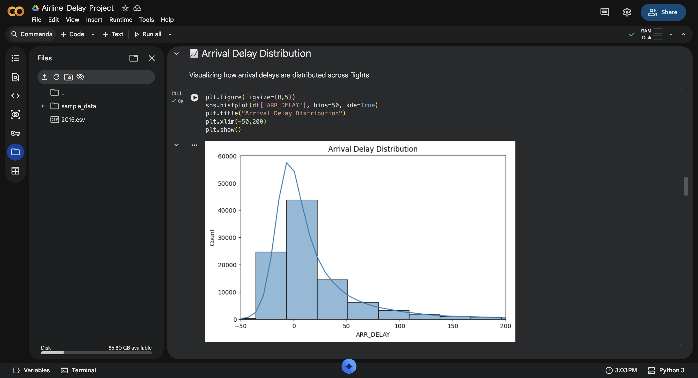
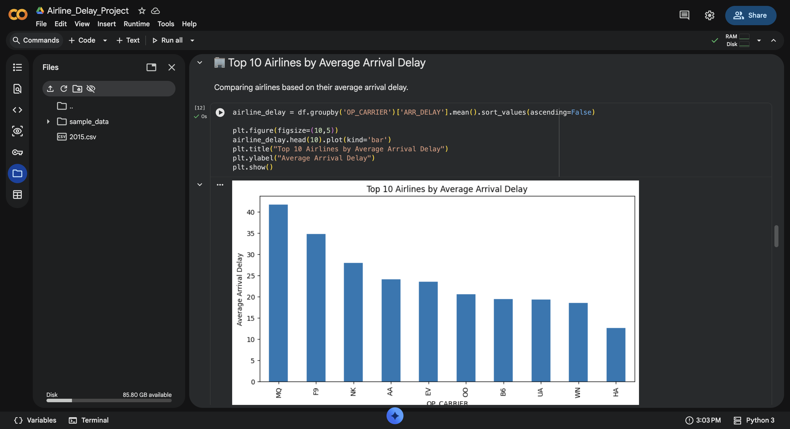
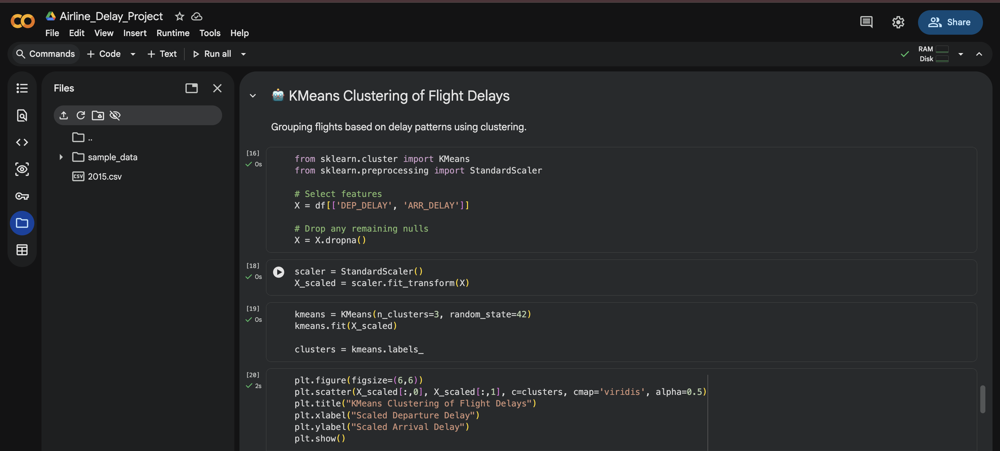
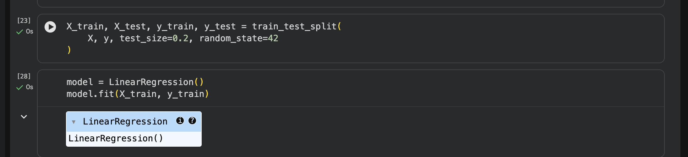
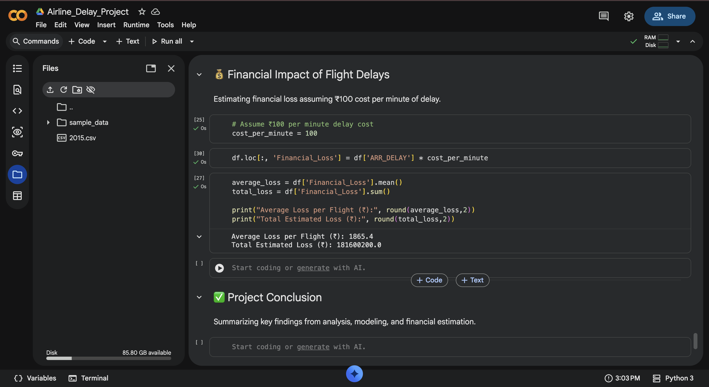

# ✈️ Airline Delay Prediction & Financial Impact Analysis
## 🌐 Live Demo App

The deployed Streamlit application can be accessed here:

🔗 https://airline-delay-prediction.streamlit.app

## 🌐 Live Demo Dasboard
🔗 https://whatisthissam-airline-delay-prediction-financial-imp-app-0hspkk.streamlit.app/

## 📌 Project Overview 

Flight delays significantly affect airline profitability and customer satisfaction.
This project analyzes airline delay patterns, predicts arrival delays using Machine Learning, and estimates financial loss impact.

## 📌 Business Problem Statement

Airline delays create operational inefficiencies, increase costs, reduce customer satisfaction, and impact revenue optimization. 
This project aims to analyze delay patterns, apply machine learning models, and quantify financial losses to support better strategic decision-making.

## 🎯 Objectives

• Analyze delay patterns using Exploratory Data Analysis (EDA)

• Segment flights into risk clusters using K-Means Clustering

• Predict arrival delays using Linear Regression

• Estimate financial loss caused by delays

• Deploy an interactive prediction dashboard using Streamlit

## 📊 Dataset

The dataset contains flight-level operational data including:

• Airline Carrier

• Flight Distance

• Departure Delay

• Arrival Delay

## 🔗 Dataset Source

Airline Delay Analysis Dataset (2015)

Source: Kaggle  
https://www.kaggle.com/datasets/sherrytp/airline-delay-analysis

The dataset contains U.S. domestic flight delay records including departure delay, arrival delay, carrier delay, weather delay, and other operational factors.

## 🛠 Technologies Used

• Python

• Pandas & NumPy

• Matplotlib & Seaborn

• Scikit-learn

• Streamlit

• GitHub

## 🔍 Methodology
## 1️⃣ Data Cleaning & Preprocessing

• Removed missing values

• Selected relevant features

• Filtered extreme values

## 🤖 AI Techniques Used

• K-Means Clustering (Unsupervised Learning)  
• Linear Regression (Supervised Learning)  
• Feature Scaling using StandardScaler  
• Model Evaluation using R² Score

## 2️⃣ Exploratory Data Analysis

• Delay distribution analysis

• Airline-wise delay comparison

• Correlation analysis

## 3️⃣ K-Means Clustering

• Flights were segmented into:

• Low Delay Risk

• Medium Delay Risk

• High Delay Risk

• This helps identify operational risk zones.

## 4️⃣ Linear Regression Model

Arrival delay was predicted based on:

• Flight distance

• Departure delay

Model performance evaluated using R² Score.

## 💰 Financial Loss Estimation
Assumption:
₹100 per minute of delay.

Financial Loss Formula:
Financial Loss = Arrival Delay × Cost per Minute

This quantifies operational inefficiencies in monetary terms.

## 🌐 Deployment

An interactive Streamlit application allows users to:

• Input flight distance

• Input departure delay

• Predict arrival delay

• Estimate financial loss

## 📈 Key Findings

• Departure delay strongly impacts arrival delay.

• Certain airline routes fall into high-risk delay clusters.

• Operational inefficiencies directly translate into revenue loss.

## 💡 Business Recommendations

• Improve departure scheduling systems.

• Focus on high-delay clusters.

• Use predictive analytics for proactive planning.

• Monitor delay cost impact regularly.

## 📈 Economic Concepts Applied

• Demand-Supply Imbalance – Delays affect flight availability and customer demand patterns.  
• Revenue Optimization – Predicting delays helps improve pricing and scheduling strategy.  
• Cost Analysis – Delay-based financial loss estimation highlights operational cost impact.  
• Risk Management – Clustering identifies high-risk operational segments.

## 📸 Output Screenshots

### 📊 Arrival Delay Distribution

### ✈ Airline Comparison Chart

### 🔵 K-Means Clustering Output

### 📈 Linear Regression Performance

### 💰 Financial Loss Estimation

## 👥 Team

This project was developed collaboratively as part of an academic group submission.

- **Ragini Singh** – Data Cleaning, EDA, Visualization, ML Modeling, Financial Analysis, Documentaion , Deployeement  
- **Saumya Chinchkhede** – Dataset Preparation, Feature Understanding, EDA Support  
- **Sameer Rathod** – Model Evaluation, Result Interpretation  
- **Aaditya Prasad** – Business Insights, Financial Interpretation, Conclusion Support  

---

# 🚀 Conclusion

Integrating machine learning with business strategy enables airlines to minimize financial losses and improve operational efficiency.
